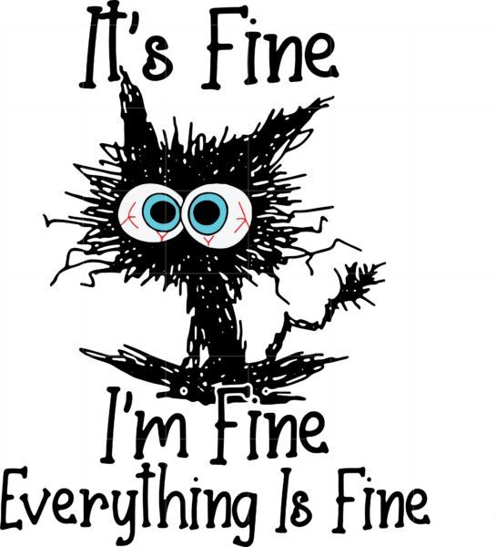

# Advent of Code

My submissions for the [Advent of Code](https://adventofcode.com/) challenges written in Rust.

## Why Rust

I am learning Rust and thought this would be a good way to do it. I must admit that after some of these challenges I actually miss Python. However I will dig deep and push through.

